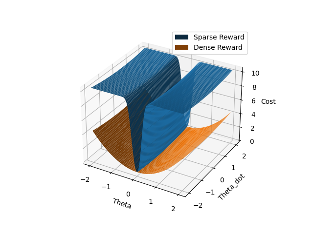
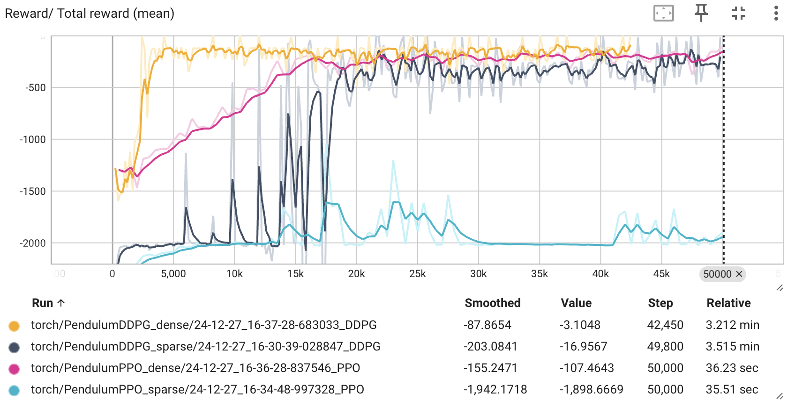

### Install requirements

```
pip3 install -r requirements.txt
```

-------------------------------------------

### Code structure

```
code
├── DDPG.py
├── PPO.py
├── reward.py
└── images
    ├── reward.png
    └── total_reward_mean.png
README.md
requirements.txt
```


-------------------------------------------


### Visualize Reward

```
python3 reward.py
```

<figure>
  
</figure>


### Run DDPG

1) Sparse Reward

```
python3 DDPG.py --nb_timesteps 50000 --reward_type sparse
```

2) Dense Reward

```
python3 DDPG.py --nb_timesteps 50000 --reward_type dense
```

-------------------------------------------


### Run PPO

1) Sparse Reward

```
python3 PPO.py --nb_timesteps 50000 --reward_type sparse
```

2) Dense Reward

```
python3 PPO.py --nb_timesteps 50000 --reward_type dense
```

### Results

<figure>
  
</figure>