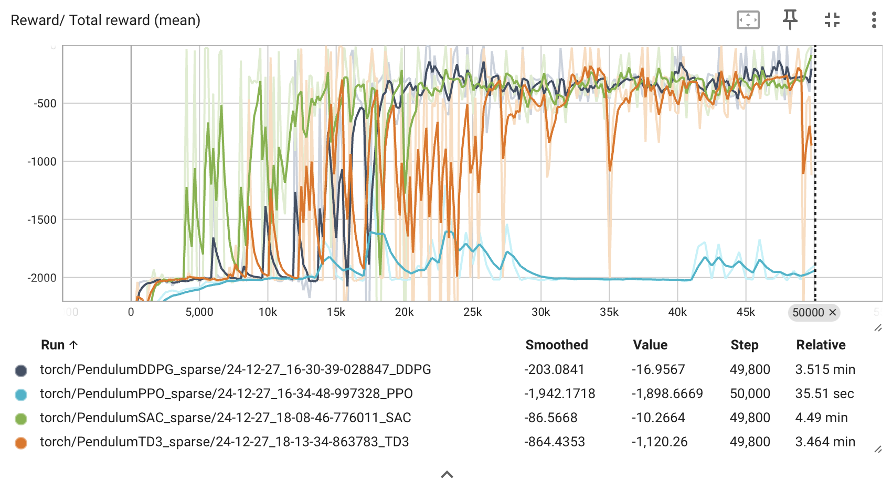
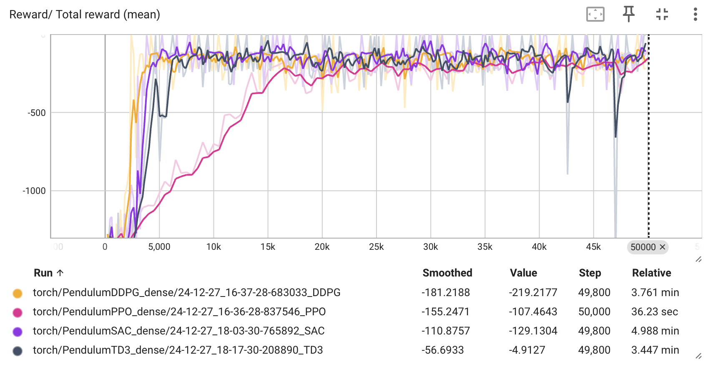

## Description

### Comparative Analysis of DDPG, PPO, SAC and TD3 Agent Performance Using Distinct Reward Structures

This code evaluates the performance of 4 reinforcement learning agents, DDPG, PPO, TD3 and SAC, each subjected to two different rewards.
Example codes from SKRL were used to ensure consistent implementation and comparison across both scenarios.

**Conclusion:** PPO tends to perform worse than the other algorithms when a sparse reward was used. Note that I have not tried to further tune PPO to make it work for this reward. DDPG, TD3 and SAC perform similarly when a sparse reward is used.


### Install requirements

```
pip3 install -r requirements.txt
```

-------------------------------------------

### Code structure

```
code
├── DDPG.py
├── PPO.py
├── TD3.py
├── SAC.py
├── reward.py
└── images
    ├── reward.png
    ├── total_reward_mean.png
    ├── sparse_rewards.png
    └── dense_rewards.png
README.md
requirements.txt
```


-------------------------------------------


### Visualize Reward

```
python3 reward.py
```

<figure>
  
</figure>


### Run DDPG

1) Sparse/Dense Reward

```
python3 DDPG.py --nb_timesteps 50000 --reward_type sparse
```

2) Dense Reward

```
python3 DDPG.py --nb_timesteps 50000 --reward_type dense
```

-------------------------------------------

### Run PPO

1) Sparse Reward

```
python3 PPO.py --nb_timesteps 50000 --reward_type sparse
```

2) Dense Reward

```
python3 PPO.py --nb_timesteps 50000 --reward_type dense
```
-------------------------------------------

### Run TD3

1) Sparse/Dense Reward

```
python3 TD3.py --nb_timesteps 50000 --reward_type sparse
```

2) Dense Reward

```
python3 TD3.py --nb_timesteps 50000 --reward_type dense
```

-------------------------------------------

### Run SAC

1) Sparse/Dense Reward

```
python3 SAC.py --nb_timesteps 50000 --reward_type sparse
```

2) Dense Reward

```
python3 SAC.py --nb_timesteps 50000 --reward_type dense
```

### Results

<figure>
  
</figure>

#### Sparse rewards

<figure>
  
</figure>

#### Dense rewards

<figure>
  
</figure>